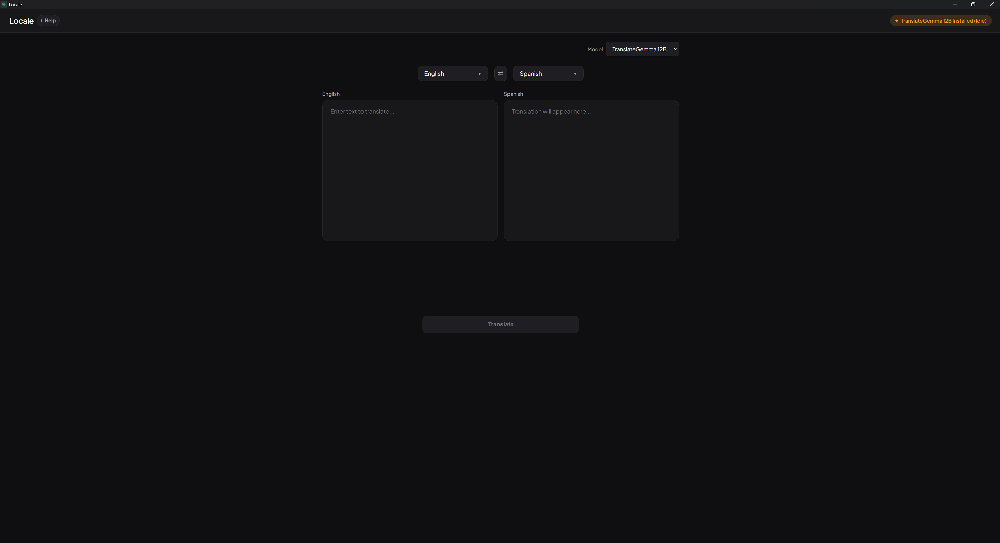

# [Locale](https://github.com/PierrunoYT/locale)

A minimal, local translation application built with Tauri, React, and TypeScript. Powered by **TranslateGemma** (4B/12B/27B) for professional-quality translation that runs entirely on your machine.

**Version**: 0.1.4 | **Status**: Production Ready | **License**: MIT



## Features

- 🤖 **Runtime model switch** - Choose TranslateGemma 4B, 12B, or 27B directly in the UI
- 🌍 **120+ languages** - Full TranslateGemma support with searchable language selector
- 🔄 **Quick language swap** functionality
- 🟢 **Live connection status** - Status badge updates every 30s and when you return to the app
- ℹ️ **How it works** - Info button in the header with a quick guide
- 🎨 **Modern UI** - Dark-first design with Plus Jakarta Sans, emerald accents, and light mode support
- 📱 **Responsive design** - Resizable text fields, translate button adapts to screen size
- ⚡ **Fast and lightweight** desktop application
- 🔒 **100% Local processing** - Your data never leaves your machine
- 🔓 **Privacy-focused** - No API keys, no cloud services, no tracking
- 🆓 **Completely free** - No subscription or usage limits

## Tech Stack

- **Frontend**: React 19 + TypeScript
- **Framework**: Tauri 2
- **Build Tool**: Vite 7
- **Styling**: CSS3 with CSS Variables
- **Translation Engine**: TranslateGemma via Ollama (4B/12B/27B)
- **Backend**: Rust with async HTTP client

## Prerequisites

### Required
- **Node.js** (v18 or higher)
- **Rust** (latest stable)
- **Ollama** - Download from [ollama.com](https://ollama.com/download)
- **At least one TranslateGemma model** - Install via Ollama (see setup below)

### System Requirements
- **RAM**: 16GB+ recommended (8GB minimum with 4B model)
- **Disk Space**: 10GB free (for model storage)
- **OS**: Windows, macOS, or Linux

## Quick Start

### 1. Install Ollama

Download and install Ollama from [ollama.com](https://ollama.com/download), then verify:

```bash
ollama --version
```

### 2. Install a TranslateGemma model

```bash
ollama run translategemma:4b
```

This downloads the selected model and starts Ollama. `4b` is the lightest option; `12b` and `27b` are available for higher quality.

### 3. Install Locale

```bash
git clone https://github.com/PierrunoYT/locale
cd locale/localtranslate
npm install
```

### 4. Run the Application

```bash
npm run tauri:dev
```

You should see a status badge indicating the model state:
- 🟢 **Running** - Model is loaded and ready
- 🟠 **Installed (Idle)** - Model is installed but not loaded (will auto-load on first translation)
- 🔴 **Disconnected** - Ollama is not running

> **Note:** The app works in both "Running" and "Installed (Idle)" states. When idle, the first translation takes 3-5 seconds as Ollama loads the model into memory, then subsequent translations are fast (~1-2 seconds).

> 📖 **Need help?** See the [detailed setup guide](SETUP_GUIDE.md) for troubleshooting and advanced configuration.

### Build Scripts

- **`npm run tauri:dev`** - Normal development mode (hot reload)
- **`npm run tauri:clean`** - Clean rebuild (clears all caches - use if changes aren't showing)

## Development

**Start development mode:**
```bash
npm run tauri:dev
```

**If changes aren't showing (cache issues):**
```bash
npm run tauri:clean  # Clears all caches and rebuilds
```

**Common cache issues:**
- Rust changes not updating → Delete `src-tauri/target/` folder
- React/Vite changes not updating → Delete `node_modules/.vite/` folder
- Both not updating → Use `npm run tauri:clean`

## Building

Build the production desktop app:
```bash
npm run tauri build
```

The built application will be in `src-tauri/target/release/`.

**Build artifacts:**
- Windows: `.exe` installer
- macOS: `.dmg` and `.app`
- Linux: `.deb`, `.AppImage`

## Project Structure

```
localtranslate/
├── src/                 # React frontend source
│   ├── App.tsx         # Main application component
│   ├── App.css         # Application styles
│   ├── LanguageSelect.tsx  # Searchable language selector
│   ├── languages.ts    # Full language list (120+)
│   └── main.tsx        # React entry point
├── src-tauri/          # Rust backend source
│   └── src/            # Rust source files
├── public/             # Static assets
└── package.json        # Node.js dependencies
```

## Usage

1. **Start Ollama** (if not already running):
   ```bash
   ollama serve
   ```

2. **Launch Locale** and wait for the connection indicator (updates every 30s and when you return to the app)

3. **Translate:** (click the ℹ️ **Help** button in the header for a complete guide)
   - Select a model from the **Model** dropdown (4B/12B/27B)
   - Click a language button to open the searchable dropdown
   - Search by name or code (e.g., "spanish", "ja", "arabic")
   - Select source and target languages
   - Enter text in the left panel
   - Click **"Translate"**
   - Translation appears in the right panel

4. **Swap Languages:** Use the ⇄ button to quickly reverse translation direction

## Supported Languages

**120+ languages available** with searchable dropdowns. All TranslateGemma-supported languages including:

- **European:** English, Spanish, French, German, Italian, Portuguese, Dutch, Swedish, Russian, Ukrainian, Polish, Czech, Greek, Turkish, and more
- **Asian:** Chinese, Japanese, Korean, Hindi, Thai, Vietnamese, Indonesian, Malay, Persian, Arabic, Hebrew, and more
- **Other:** Swahili, Yoruba, Zulu, Amharic, Bengali, Tamil, and 80+ additional languages

Use the search box in each language selector to quickly find any language by name or code.

## Translation Quality

TranslateGemma 12B delivers professional-grade translation quality:
- ✅ **Outperforms larger models** on standardized translation benchmarks
- ✅ **Context-aware** translations with cultural sensitivity
- ✅ **Maintains nuance** and idiomatic expressions
- ✅ **128K token context window** for long documents

## Performance

- **First translation**: ~3-5 seconds (model loading)
- **Subsequent translations**: ~1-2 seconds
- **Memory usage**: ~8GB RAM during translation
- **Offline capable**: Works without internet after model download

## Why Local Translation?

### Privacy First
- ✅ No data sent to cloud services
- ✅ No API keys or account required
- ✅ No usage tracking or telemetry
- ✅ Works completely offline

### Cost Effective
- ✅ Zero API costs
- ✅ No subscription fees
- ✅ Unlimited translations
- ✅ One-time setup

### Quality & Control
- ✅ Professional translation quality
- ✅ Consistent results
- ✅ Full control over model selection
- ✅ Open source transparency

## Troubleshooting

### "Ollama is not running"
Start Ollama in a terminal:
```bash
ollama serve
```

### "translategemma:<size> model not found"
Install the model selected in the app:
```bash
ollama run translategemma:4b
```

### Slow performance / Out of memory
Use the model selector in the app and switch to the smaller 4B model (requires only 8GB RAM):
```bash
ollama run translategemma:4b
```
No code changes are required.

### Changes not showing in app
Clear all caches and rebuild:
```bash
npm run tauri:clean
```

See [SETUP_GUIDE.md](SETUP_GUIDE.md) for detailed troubleshooting.

## Model Options

| Model | Size | RAM Required | Speed | Quality |
|-------|------|--------------|-------|---------|
| **4B** | 3.3GB | 8GB | Fastest | Good |
| **12B** | 8.1GB | 16GB | Fast | Excellent ⭐ |
| **27B** | 17GB | 32GB | Slower | Best |

**Default:** 4B (fastest and most accessible)

## Advanced Configuration

### Change Translation Model

Use the **Model** dropdown above the language selectors to switch between:
- `translategemma:4b`
- `translategemma:12b`
- `translategemma:27b`

Your selection is saved locally and reused when you reopen the app.

### Add More Languages

Edit `src/languages.ts` to add or modify languages. The app includes all 120+ TranslateGemma-supported languages by default. See [Ollama TranslateGemma docs](https://ollama.com/library/translategemma) for the full list of supported language codes.

## Architecture

```
┌─────────────────┐
│   React UI      │  User Interface (TypeScript)
└────────┬────────┘
         │
    Tauri Bridge
         │
┌────────▼────────┐
│   Rust Backend  │  HTTP Client + Translation Logic
└────────┬────────┘
         │
   HTTP Request
         │
┌────────▼────────┐
│     Ollama      │  Local API Server
└────────┬────────┘
         │
┌────────▼────────┐
│ TranslateGemma  │  AI Translation Model
│ 4B/12B/27B      │  (Runs locally on your machine)
└─────────────────┘
```

## Contributing

Contributions are welcome! Areas for improvement:
- Additional language support in UI
- Translation history/favorites
- Batch translation support
- Custom terminology/glossaries
- UI/UX enhancements

Please feel free to submit a [Pull Request](https://github.com/PierrunoYT/locale/pulls).

## Version History

See [CHANGELOG.md](localtranslate/CHANGELOG.md) for detailed release notes.

**Current Version**: 0.1.4 (2026-02-12)
- Enhanced three-state connection status (Running/Installed/Disconnected)
- Improved info modal showing all available models with installation commands
- Better help discoverability with dedicated troubleshooting section

## License

This project is licensed under the [MIT License](LICENSE).

TranslateGemma model is subject to the [Gemma Terms of Use](https://ai.google.dev/gemma/terms).

## Resources

- [GitHub Repository](https://github.com/PierrunoYT/locale)
- [TranslateGemma Model](https://ollama.com/library/translategemma)
- [Ollama Documentation](https://docs.ollama.com)
- [Setup Guide](SETUP_GUIDE.md)
- [Tauri Documentation](https://tauri.app)

## Recommended IDE Setup

- [VS Code](https://code.visualstudio.com/) + [Tauri](https://marketplace.visualstudio.com/items?itemName=tauri-apps.tauri-vscode) + [rust-analyzer](https://marketplace.visualstudio.com/items?itemName=rust-lang.rust-analyzer)

---

**Built with ❤️ using TranslateGemma, Tauri, React, and Rust**
